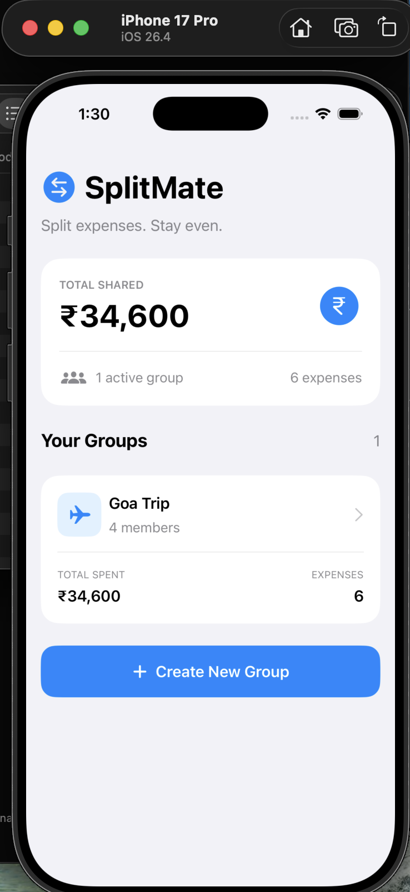
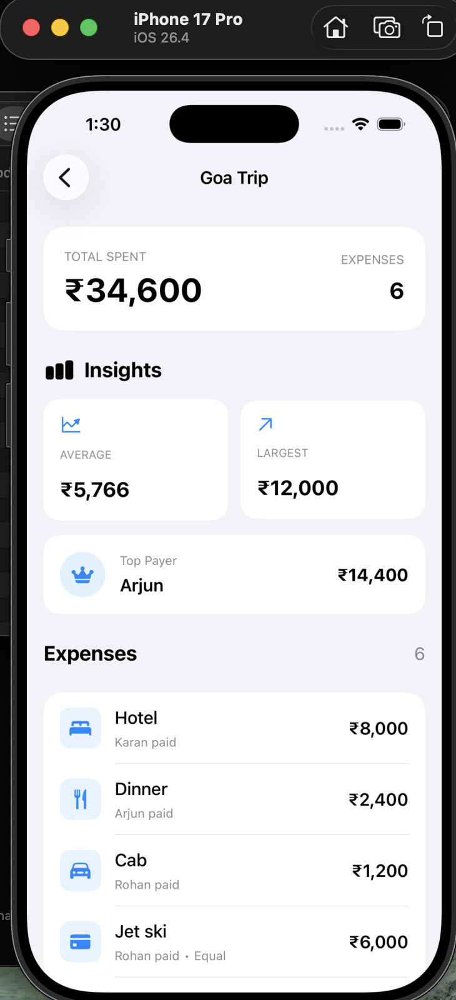
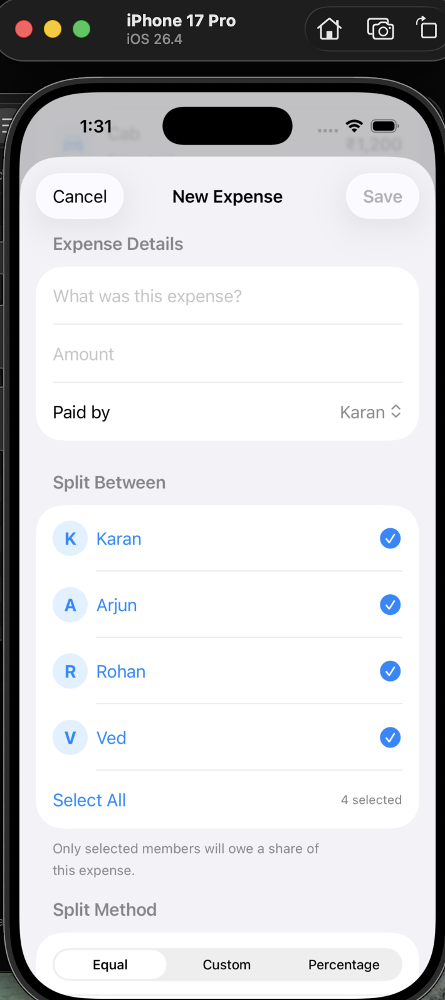
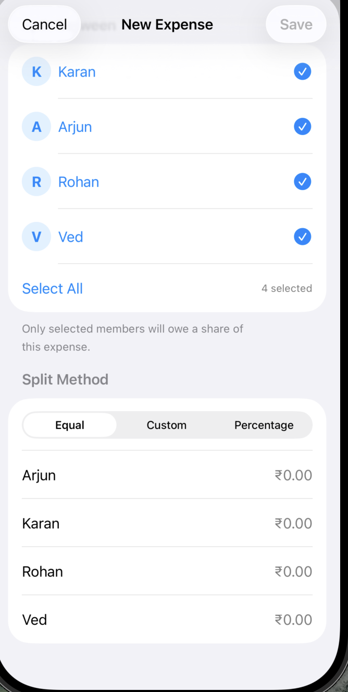
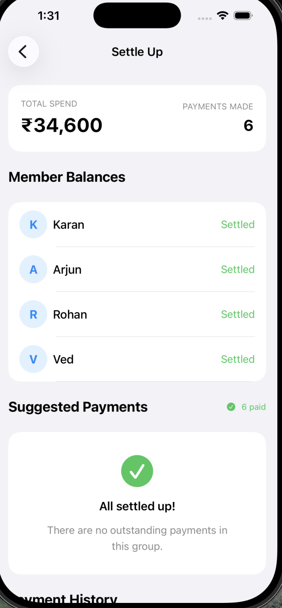
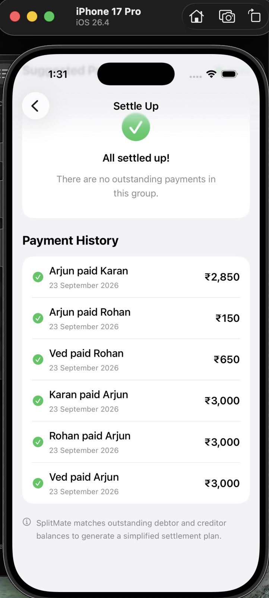

# SplitMate

SplitMate is a native iOS expense-sharing application built with Swift and SwiftUI. It helps groups track shared expenses, handle different splitting scenarios, calculate individual balances, and simplify settlements.

The project focuses on clean iOS development, practical expense-splitting logic, persistent local data, and a simple native user experience.

## Features

- Create expense groups with multiple members
- Add and track shared expenses
- Select exactly which members participated in an expense
- Split expenses using:
  - Equal Split
  - Custom Amounts
  - Percentage Split
- Track who paid for each expense
- Calculate individual member balances dynamically
- Generate simplified debtor-to-creditor settlement suggestions
- Mark settlements as paid
- Maintain settlement payment history
- View spending insights including:
  - Average expense
  - Largest expense
  - Top payer
- Delete expenses using a native context menu
- Persist groups, expenses and settlement data locally across app launches
- Context-aware icons for groups and expense categories

## Tech Stack

- Swift
- SwiftUI
- iOS SDK
- Xcode
- Codable
- UserDefaults
- Git & GitHub

## Architecture

SplitMate separates application responsibilities into Models, Services and Views.

```text
SplitMate
├── Models
│   ├── Expense.swift
│   ├── ExpenseGroup.swift
│   ├── Settlement.swift
│   └── SplitMethod.swift
│
├── Services
│   ├── PersistenceService.swift
│   └── SettlementEngine.swift
│
├── Views
│   ├── AddExpenseView.swift
│   ├── AddGroupView.swift
│   ├── BalancesView.swift
│   ├── GroupCard.swift
│   ├── GroupDetailView.swift
│   └── InsightsView.swift
│
├── ContentView.swift
└── SplitMateApp.swift
```

## Expense Splitting

Each expense stores the payer and the amount owed by each participating member.

SplitMate supports three splitting methods:

**Equal** — divides the expense equally between selected participants.

**Custom** — allows a specific amount to be assigned to each participant while validating that the allocations equal the total expense.

**Percentage** — allows percentage-based allocation while validating that the percentages total 100%.

Members who did not participate in an expense are not included in that expense's owed amount.

## Balance & Settlement Logic

For each member, SplitMate calculates a net balance using:

```text
Net Balance = Total Paid - Total Owed
```

A positive balance means the member should receive money, while a negative balance means the member owes money.

The settlement engine separates members into creditors and debtors and matches their outstanding balances to produce a simplified set of suggested payments.

Completed settlement payments are recorded and incorporated back into the balance calculation so remaining balances and settlement suggestions update automatically.

## Persistence

Application data is encoded using Swift's `Codable` system and stored locally using `UserDefaults`.

This allows groups, expenses and completed settlement payments to remain available after the application is closed and relaunched.

## Screenshots

### Home Dashboard


### Group Dashboard & Spending Insights


### Add Expense


### Flexible Split Methods


### Balances & Settlement Suggestions


### Settlement Payment History


## Running the Project

1. Clone the repository:

```bash
git clone https://github.com/KaranKumar0408/SplitMate.git
```

2. Open `SplitMate.xcodeproj` in Xcode.

3. Select an iPhone simulator.

4. Build and run the project using `⌘R`.

## Author

**Karan Kumar**

B.Tech Computer Science & Engineering (Artificial Intelligence & Data Science)

D. Y. Patil Deemed to be University, Navi Mumbai
